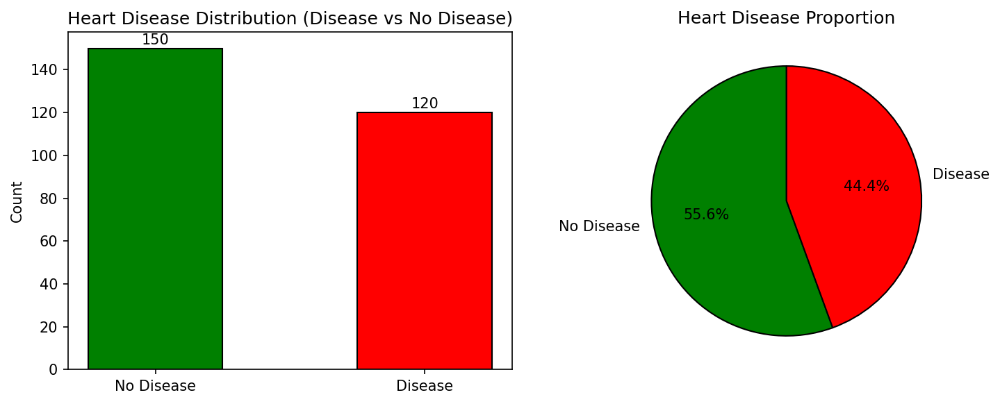
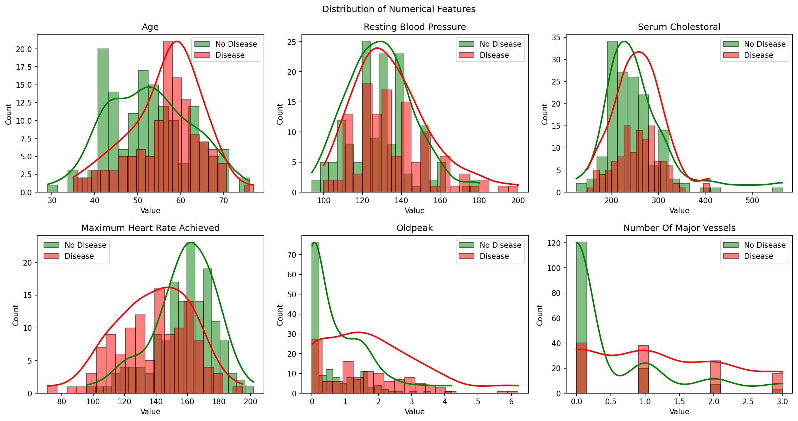
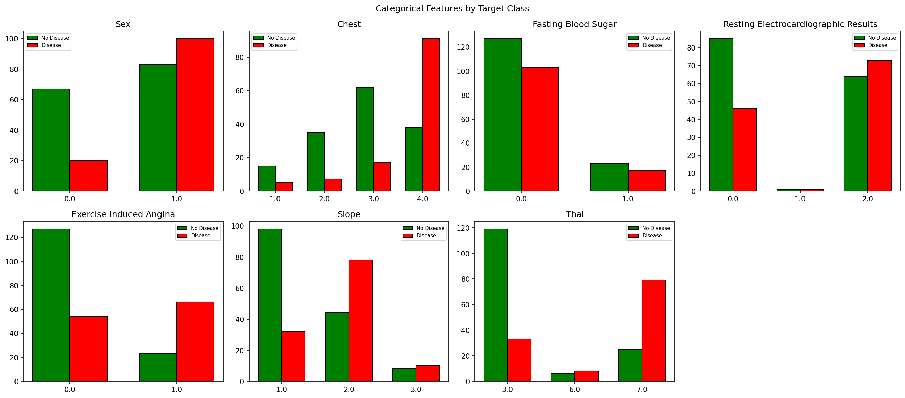
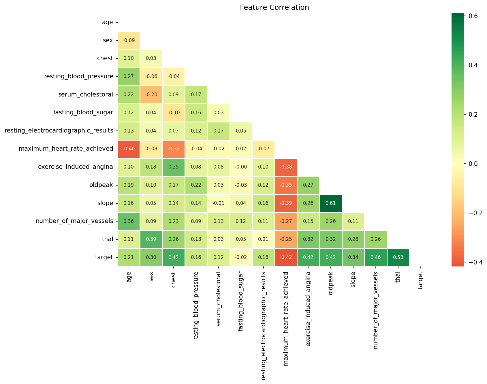
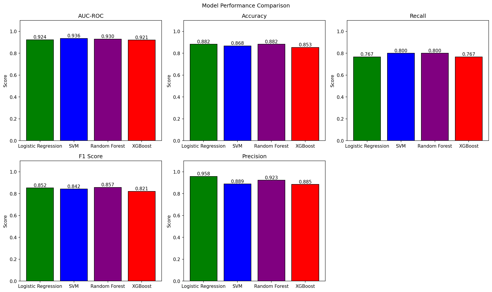
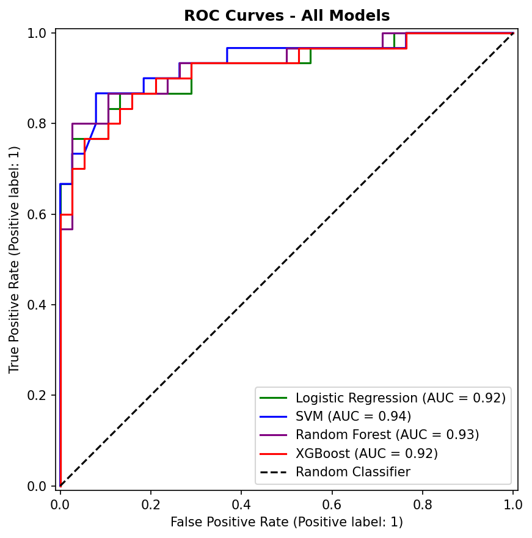
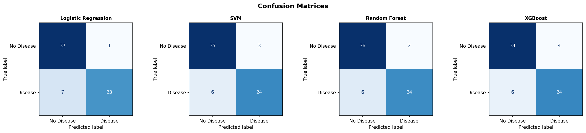

### UCI Heart Disease Data - Classfication Project

-----

## Overview
The objective of this project was to implement a Supervised Learning model to predict the presense of heart disease using the UCI Heart Disesse dataset from OpenML. The dataset includes clinical data from 270 de-identified patients with 13 features. Four classification models (Logistics Regression, Support Vector Machine, Random Forest, and XGBoost) were trained and evaluated to compare performance metrics.

Due to the nature of the dataset and clinical question, Recall was an emphasis of optimization to ensure Fasle Negatives are minimized. The optimal model achieves a 0.90 Recall, 0.93 AUC-ROC, 0.88 Accuracy, and a 0.87 F1 Score.

## Dataset
| Property | Value |
|---|---|
| **Source** | UCI Machine Learning Repository |
| **OpenML ID** | 46590 |
| **Patients** | 270 |
| **Features** | 13 clinical features |
| **Target** | Heart disease presence (0 = absent, 1 = present) |
| **Class Distribution** | 55.6% No Disease / 44.4% Disease |

**Citation**
https://www.openml.org/search?type=data&status=active&id=46590&sort=runs

## Project Structure
UCI-Heart-Disease-Project/
├── main.py                        
├── outputs/
│   └── plots/
│       ├── 01_target_distribution.png
│       ├── 02_numerical_distributions.png
│       ├── 03_categorical_counts.png
│       ├── 04_correlation_plot.png
│       ├── 05_model_comparison.png
│       ├── 06_roc_curves.png
│       ├── 07_confusion_matrices.png
│       ├── 08_random_forest_optimal_threshold.png
├── pyproject.toml
├── uv.lock
└── README.md

## Project Sections
| Section | Description |
|---|---|
| **1. Data Ingestion** | Load dataset from OpenML, inspect shape, descriptive stats, missing value check, encode target to binary |
| **2. EDA & Visualization** | Target distribution, numerical and categorical feature distributions,  correlation plot, key correlation highlight|
| **3. Feature Engineering** | Drop weak features, stratified train/test split, log transforms, scaling |
| **4. Model Training** | GridSearchCV tuning (RF, XGBoost, SVM), individual model evaluation, results comparison |
| **5. Model Diagnostics** | Bias-variance analysis, Threshold sweep across all models, determination of optimal model |

## Data Visualization

NOTE: Skewness is observed in the serum_cholestrol and oldpeak variabes that may need to addressed for the Logistic Regression and SVM models.

NOTE: The fasting_blood_sugar variable's correlation to the target variable is nearly 0. The decision was made to drop this variable for this analysis.

## Results
| Model | AUC-ROC | Accuracy | Recall | F1 Score |
|---|---|---|---|---|
| Logistic Regression | 0.9175 | 0.8971 | 0.8333 | 0.8772 |
| SVM | 0.9211 | 0.8824 | 0.8333 | 0.8621 |
| Random Forest | 0.9342 | 0.8676 | 0.8000 | 0.8421 |
| XGBoost | 0.9114 | 0.8382 | 0.8000 | 0.8136 |

## Model Dianostics
The Train vs Test AUC Gaps were evaluated to check models fits

| Model | Train AUC | Test AUC | Gap |
|---|---|---|---|---|
| Logistic Regression | 0.9191 | 0.9175 | 0.0016 |
| SVM | 0.9177 | 0.9211 | -0.0033 |
| Random Forest | 0.9938 | 0.9342 | 0.0595 |
| XGBoost | 1.0 | 0.9114 | 0.0886 |

All gaps are no more than +/- 0.10. All models seem to be show no sigs of over/underfitting.

Finally, a threshold swepp was conducted on all models to evaluate optimal classification cutoff. While all models were evaluated at the default threshold of 0.50, a threshold of 0.44 with the Random Forest model demonstrated the most optimal results of 0.90 Recall, 0.93 AUC-ROC, 0.88 Accuracy, and a 0.87 F1 Score. Interestingly, this threshold mirrors prevalence of the disease within our dataset (44.4%). This demonstrates the of role class imbalances within classification problems.

## References
- Janosi, A., Steinbrunn, W., Pfisterer, M., & Detrano, R. (1989). Heart Disease [Dataset]. UCI Machine Learning Repository. https://doi.org/10.24432/C52P4X 
- IBM. (2025). What Is Overfitting vs. Underfitting?. https://www.ibm.com/think/topics/overfitting-vs-underfitting
- scikit-learn Developers. (2024). Classification Threshold — scikit-learn. Documentation. https://scikit-learn.org/stable/modules/classification_threshold.html